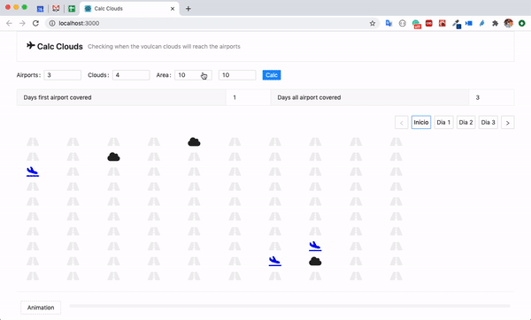

## Funcionalidades

O Sistema Renderiza o andamento das nuvens de um vulcão em erupção para alcançar os aeroportos.

1. Permite enviar um determinado número de nuvens de no mínimo 4;
2. Permite enviar um determinado número de aeroportos de no mínimo 3;
3. Permite escolher o tamanho do grid, sendo no mínimo 10x10;
4. Calcula o número de dias em que o primeiro aeroporto foi coberto pelas nuvens;
5. Calcula o número de dias em que todos os aeroportos foram cobertos pelas nuvens;
6. Retorna o desenho de cada dia fazendo a evolução das nuvens nos dias respectivos;
7. Permite o usuário navegar pelos dias vendo o comportamento das nuvens em cada dia;
8. Permite o usuário ver uma animação dos dias;



## App em produção

O endereço para acessar o app em produção é: [https://cbyk-clouds.herokuapp.com/](https://cbyk-clouds.herokuapp.com/).


## Backend

### Tecnologias
* NodeJS
* Krakenjs


### Setup
* ```npm install``` ou ```yarn install```


### Rodando a aplicação
* ```npm start``` ou ```yarn start```

### Rodando os testes
* ```npm test```


## Frontend

### Tecnologias
* Javascript
* ReactJS
* Ant Design (UI Framework)

### Configurações

Crie um arquivo .env com a informação `REACT_APP_SERVER` apontando para o seu servidor.

```
REACT_APP_SERVER=http://127.0.0.1:8000
```

### Setup
* ```yarn install``` ou ```npm install```


### Rodando a aplicação
* ```yarn start``` ou ```npm start```
